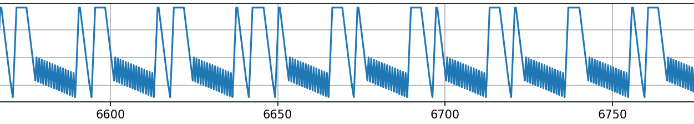

# mm100_visualizer

起動まで時間がかかることがあります
オープンソースです(sourceフォルダーにあります)

- mac
  - mm100_visualizer をダウンロード
- windows
  - mm100_visualizer.exe をダウンロード

## 使い方

1. ファイルを選択
2. show_each_region だけを選択

3. Confirm
4. 下のボックスにdoneが出るまで待つ
どこかの`imgs`フォルダーに画像が出力されます

全体とそれぞれの領域が5分づつ、**時間 (s)-z軸の高さ (mm)** のグラフが表示されています

電極がこうなってればいいのですが、

たまにこうなっていることがあります。これは片側の電極の掘り方が壊れているのでRhinoで作り直しましょう

あとはz軸が -6.1\~0.0 mmの間を掘っているか
領域がちゃんと5つあるか（セパレーター、大円、、、）
compare_nc、xyだけにチェックを入れConfirmして掘る範囲が 0\~100 mm以内に収まっているかなどをお好みで確認します。

## 詳しい使い方

- compare_nc
  - wz

  - xy

- show_each_region

- show_index
上から時間に対するx,y,zのどれか、ミルの動くスピード、ncファイル上での行数（region (s)は 60秒程度がおすすめ）
  - region:空白, zのみ

  - region:0-60, zのみ

## 複数ファイル

ブラウズの時ファイルを複数選択するとcompare_ncで出力される画像が変わります

show_each_region, show_indexは変わりません

- compare_nc
  - wz
    - single_graph あり

    - single_graph なし

  - xy
    - single_graph あり

    - single_graph なし

## versions

23/10/29 1.0
24/1/24 1.1
24/1/30 1.2.1

## 動作確認

mac Ventura 13.6
windows 22H2
